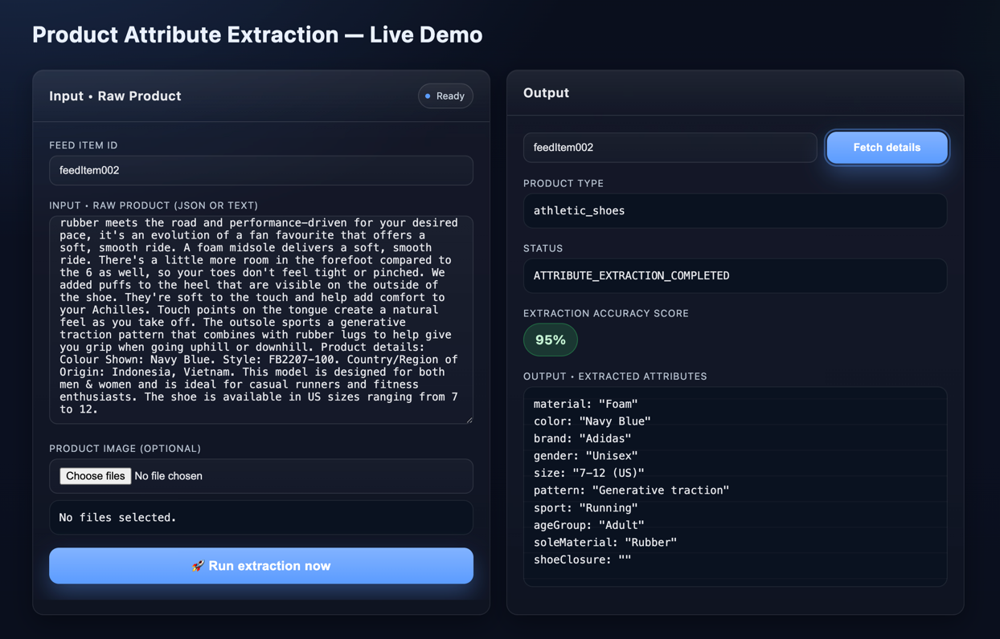

## 🗂️ Table of Contents
- [Overview](#-overview)
- [System Architecture](#-system-architecture)
- [OpenAPI & Swagger](#-openapi--swagger)
- [Application Setup](#-application-setup)
- [Example Endpoints](#-example-endpoints)
- [Tech Stack Summary](#-tech-stack-summary)
- [Project Structure](#-project-structure)
- [Future Enhancements](#-future-enhancements)
- [Demo Screens](#-future-enhancements)

# 🧠 Autospec Service – Product Spec extraction from product Descriptions and Images

The **Autospec Service** is a Spring Boot–based, multi-module microservice that performs **automated product type classification** and **attribute extraction** using **Large Language Models (Gemma & Grok)**.  
It supports ingestion of textual and visual product data, runs hybrid NLP + Vision pipelines, and exposes REST APIs for classification, extraction, and batch operations.

---

## 🚀 Overview

| Feature | Description |
|----------|--------------|
| **Tech Stack** | Java 17 · Spring Boot 3.4.5 · MongoDB · Maven · Docker (optional) |
| **Architecture** | Hexagonal / Port-Adapter · Modular (Spring multi-module build) |
| **Modules** | `autospec-app` (Boot app) · `autospec-domain` · `autospec-services` · `autospec-adapters` · `autospec-data-processing` |
| **AI Models** | Gemma (for text attribute extraction) and Grok (for image attribute extraction) |
| **Documentation** | OpenAPI 3.0 spec + Swagger UI for live exploration |

---

## 🏗️ System Architecture

> 📌 Insert your architecture diagram image below.

**High-Level Flow**

1. Product feed items (text + images) are ingested through REST endpoints.
2. Text and image data are processed via LLM pipelines (Gemma / Grok).
3. Extracted attributes and classifications are stored in MongoDB.
4. The system exposes APIs for querying and batch operations.

---

## 📘 OpenAPI & Swagger

| Endpoint | Description |
|-----------|--------------|
| **Swagger UI** | [http://localhost:8088/swagger-ui/index.html](http://localhost:8088/swagger-ui/index.html) |
| **OpenAPI YAML** | [http://localhost:8088/openapi.yaml](http://localhost:8088/openapi.yaml) |
| **Generated API Docs (JSON)** | [http://localhost:8088/v3/api-docs](http://localhost:8088/v3/api-docs) |

The `openapi.yaml` resides under  
`autospec-app/src/main/resources/static/` and is automatically served when the application runs.

The documentation enables:
- **Interactive API testing** through Swagger UI
- **Client SDK generation** (Java / TypeScript / Python) via OpenAPI Generator
- **Contract validation** in CI pipelines

---

## ⚙️ Application Setup

### ✅ Prerequisites
- Java 17 + Maven 3.8+
- MongoDB (local or Docker)
- Git

### 🪜 Steps to Run

1. **Clone the repository**

   git clone https://github.com/<your-username>/autospec-service.git
   cd autospec-service

2. **Build the Project**

    mvn clean install

3. **Start MongoDB**

    Setup Rancher Desktop
    Pull Docker Image
    Run the Docker Container for Mongo DB
    Connect to Mongo DB via Docker CLI

4. **Configure MongoDB connection**
   spring.data.mongodb.uri=mongodb://localhost:27017/autospec_db (Your Mongo DB Path)
   spring.application.name=autospec-service
   server.port=8088

5. **Run the Application**
   Run the main class AutospecApplication.java located in
   autospec-app/src/main/java/com/wm/AutospecApplication.java
   
6. **Verify setup**
   Once the application starts successfully, verify that both Swagger UI and the OpenAPI spec are accessible:
    Swagger UI: http://localhost:8088/swagger-ui/index.html 
    OpenAPI YAML: http://localhost:8088/openapi.yaml

---

## 🧪 Example Endpoints

Below are the primary REST endpoints exposed by the Autospec Service:

| **HTTP Method** | **Endpoint** | **Description** |
|-----------------|--------------|-----------------|
| **GET** | `/autospec/api/v1/feedItem/{feedItemId}` | Retrieve a stored product feed item by its ID. |
| **POST** | `/autospec/api/v1/feedItem/{feedItemId}` | Create or update a product feed item. |
| **POST** | `/autospec/api/v1/feedItem/{feedItemId}/classify` | Classify a single product into its appropriate category. |
| **POST** | `/autospec/api/v1/feedItem/{feedItemId}/extract` | Extract product attributes such as brand, color, or size. |
| **POST** | `/autospec/api/v1/feedItem/classify/batch` | Perform batch classification for multiple product feed items. |
| **POST** | `/autospec/api/v1/feedItem/extract/batch` | Perform batch attribute extraction for multiple product feed items. |

---

## 🧰 Tech Stack Summary

| **Layer** | **Technology** |
|------------|----------------|
| **Framework** | Spring Boot 3.4.5 · Spring Data MongoDB |
| **Language** | Java 17 |
| **Build Tool** | Maven 4.0 |
| **Database** | MongoDB 6+ |
| **AI Models** | Gemma (Text) · Grok (Image) |
| **Documentation** | OpenAPI 3 · Swagger UI · Redoc |
| **Testing** | JUnit 5 · Spock (Groovy) |

---

## 🧩 Project Structure

The **Autospec Service** follows a modular architecture, where each Maven module encapsulates a specific layer of the system.  
This structure enhances maintainability, testability, and scalability while supporting independent builds and clear separation of concerns.

| **Module** | **Purpose** | **Key Responsibilities** |
|-------------|--------------|---------------------------|
| **autospec-app** | Application Layer | - Acts as the Spring Boot entry point. - Manages application configuration and bootstrapping. - Serves REST endpoints and Swagger/OpenAPI documentation. |
| **autospec-domain** | Domain Layer | - Contains core domain models, DTOs, and entities. - Defines constants and reusable value objects. - Maintains domain integrity independent of infrastructure. |
| **autospec-services** | Service Layer | - Implements business logic for product classification and attribute extraction. - Orchestrates workflows and validation logic. - Acts as the “use case” layer between controllers and adapters. |
| **autospec-adapters** | Infrastructure Layer | - Integrates with databases, Kafka, and external APIs. - Handles persistence, messaging, and third-party connections. - Provides interfaces for outbound communication. |
| **autospec-data-processing** | Controller & AI Layer | - Hosts REST controllers for data ingestion and processing. - Integrates with LLMs (Gemma & Grok) for hybrid text and image processing. - Manages pipeline execution and response mapping. |

---

## 📜 Future Enhancements

The following improvements are planned to enhance scalability, maintainability, and production readiness of the Autospec Service:

| **Area** | **Planned Enhancement** | **Objective** |
|-----------|--------------------------|----------------|
| **Security** | Implement JWT-based authentication and role-based access control. | Secure all API endpoints and enable controlled user access. |
| **Scalability** | Introduce asynchronous processing and Kafka-based event pipelines. | Handle high-throughput attribute extraction workloads efficiently. |
| **Observability** | Integrate centralized logging (ELK Stack) and distributed tracing (OpenTelemetry). | Improve issue diagnosis and system performance monitoring. |
| **Testing** | Expand automated unit, integration, and contract tests. | Increase test coverage and ensure API contract stability. |
| **Model Management** | Enable dynamic LLM model selection and versioning (Gemma, Grok, etc.). | Allow configurable model usage and performance tuning. |
| **CI/CD** | Set up GitHub Actions for build, test, and deployment pipelines. | Automate delivery workflows and ensure consistent deployments. |
| **Containerization** | Provide `Dockerfile` and `docker-compose.yml` for app + MongoDB orchestration. | Simplify setup and deployment for developers. |
| **Cloud Deployment** | Deploy to AWS / GCP using Kubernetes (EKS / GKE). | Achieve high availability and auto-scaling in production. |

> 💡 **Note:** These enhancements will be implemented iteratively as the system transitions from proof-of-concept (POC) to a fully scalable enterprise-grade microservice.

## 📜 Demo Screens

